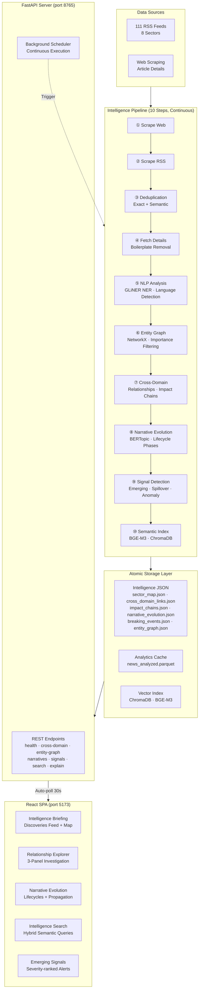
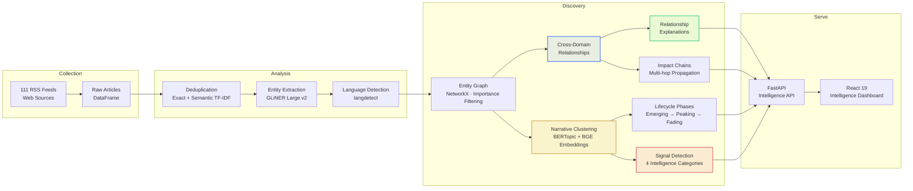
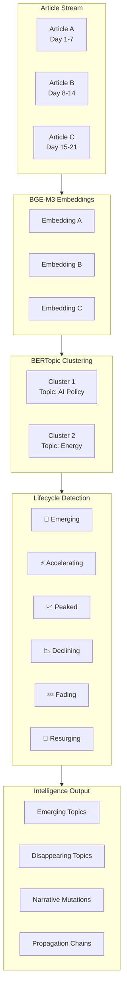

<div align="center">

# NewsPulse

### **AI-Powered Cross-Domain Intelligence Discovery Engine**

[](https://python.org)
[](https://react.dev)
[](https://fastapi.tiangolo.com)
[](https://typescriptlang.org)
[](https://developer.nvidia.com/cuda-toolkit)
[](LICENSE)

<p align="center">
  <i>Surface hidden relationships across politics, finance, technology, energy, military, and more —<br>
  before they become obvious.</i>
</p>

<br>

```
                        ╔═══════════════════════════════════════════╗
                        ║   111 RSS feeds · 8 sectors · 10-step   ║
                        ║   intelligence pipeline · continuous     ║
                        ║   autonomous execution                   ║
                        ╚═══════════════════════════════════════════╝
```

</div>

---

## Overview

NewsPulse is a fully autonomous intelligence platform that continuously monitors 111+ news sources across 8 sectors, extracts entities using state-of-the-art GLiNER NER, discovers hidden cross-domain relationships, tracks narrative evolution through BERTopic clustering, detects emerging signals, and serves everything through a polished intelligence dashboard — **all with a single command**.

Unlike traditional news analytics platforms that surface frequency-based dashboards and co-occurrence matrices, NewsPulse is designed from the ground up as an **intelligence discovery engine**. Every component — from entity extraction to relationship scoring to signal detection — is optimized to answer one question:

> **What meaningful connections exist that aren't yet obvious?**

<br>

## Vision & Mission

| | |
|---|---|
| **Vision** | Transform raw, unstructured news data into actionable cross-domain intelligence by revealing the hidden relationships, causal chains, and narrative shifts that connect seemingly unrelated sectors. |
| **Mission** | Make every intelligence discovery explainable — not just showing *that* entities are connected, but *why* they are connected, *how important* the connection is, and *what downstream effects* to monitor. |
| **Differentiation** | Most platforms track *what happened*. NewsPulse tracks *what connects across domains* — the spillover effects, the propagation chains, the emerging signals that traditional analytics miss. |

<br>

## Key Capabilities

<table>
<tr>
  <td width="50%" valign="top">
    <h3>🧠 Cross-Domain Relationship Discovery</h3>
    Automatically maps entities to 8 sectors, surfaces hidden cross-domain connections with semantic similarity scoring, and generates human-readable explanations for every relationship.
    <br><br>
    <em>Output:</em> Entity-sector map, weighted relationship graph, impact chains
  </td>
  <td width="50%" valign="top">
    <h3>📊 Narrative Evolution Engine</h3>
    Tracks how narratives emerge, accelerate, peak, decline, and resurge across time windows. Uses BERTopic clustering with BGE embeddings for coherent topic discovery.
    <br><br>
    <em>Output:</em> Narrative lifecycle phases, mutation tracking, emerging/disappearing topics
  </td>
</tr>
<tr>
  <td width="50%" valign="top">
    <h3>🚨 Intelligence Signal Detection</h3>
    Beyond simple burst detection — identifies emerging relationships, cross-domain spillover effects, influence shifts, and statistical anomalies in entity co-mentions.
    <br><br>
    <em>Output:</em> Ranked signals with types, severity scores, burst factors
  </td>
  <td width="50%" valign="top">
    <h3>🔍 Semantic Intelligence Search</h3>
    Hybrid BM25 + BGE-M3 vector search with optional BGE reranker for precision. Ask natural language questions about cross-domain intelligence.
    <br><br>
    <em>Output:</em> Relevance-ranked results with source diversity
  </td>
</tr>
<tr>
  <td width="50%" valign="top">
    <h3>🕸 Interactive Intelligence Explorer</h3>
    Three-panel exploration: entity discovery → focused relationship graph → intelligence explanation. Every edge is explainable with impact assessment and downstream effects.
    <br><br>
    <em>Interface:</em> Entity search, filtered graph, explanation panel
  </td>
  <td width="50%" valign="top">
    <h3>⚡ Fully Autonomous Operation</h3>
    Single-command startup. Background scheduler runs the full intelligence pipeline on a configurable interval. All outputs are atomically written for thread safety.
    <br><br>
    <em>Reliability:</em> Self-healing scheduler, atomic I/O, graceful recovery
  </td>
</tr>
</table>

<br>

---

## System Architecture



<br>

## Intelligence Workflow



<br>

---

## Feature Deep Dive

### 🧠 Cross-Domain Relationship Engine

The core intelligence capability. Every entity extracted from articles is classified into one of 8 sectors using keyword matching augmented with semantic context. Relationships are discovered when entities from **different sectors** co-occur across multiple articles from diverse sources.

**Relationship Score =** `semantic_similarity × 0.40 + cooccurrence_count × 0.35 + source_diversity × 0.25`

> **Traditional approach:** "Entity A and Entity B appear together → relationship exists"
>
> **NewsPulse approach:** "Entity A (technology) and Entity B (finance) co-occur in 12 articles across 5 independent sources with strong semantic similarity. This represents a validated cross-domain intelligence signal."

#### Entity Sectors

| Sector | Examples | Detection Method |
|--------|----------|-----------------|
| 🏛️ Politics | Government, elections, policy, diplomacy | Keyword + location + org matching |
| 💰 Finance | Markets, inflation, banking, trade | Financial keyword + org lexicon |
| 💻 Technology | AI, semiconductors, cloud, quantum | Tech keyword + major company orgs |
| ⚡ Energy | Oil, renewables, nuclear, EV | Energy keyword + OPEC/major orgs |
| 🛡️ Military | Defense, conflict, cyber, intelligence | Military keyword + defense orgs |
| 🚀 Startups | Funding, VC, unicorns, incubation | Startup lexicon + VC firm orgs |
| 🌍 Social | Movements, rights, healthcare, education | Social keyword + humanitarian orgs |
| 🌐 Global Events | Disasters, summits, trade wars, treaties | Event keyword + multilateral orgs |

#### Example Impact Chains

```
Iran (global_events)
  → Strait of Hormuz (energy)
    → Oil Prices (energy → finance)
      → Inflation (finance)
        → Technology Stocks (finance → technology)
```

```
China Export Restrictions (technology)
  → Semiconductor Shortage (technology)
    → Startup Funding Decline (technology → startups)
      → Innovation Slowdown (startups → technology)
```

<br>

### 📈 Narrative Evolution Engine



Each tracked entity or cluster passes through detectable lifecycle phases:

| Phase | Signal | Action |
|-------|--------|--------|
| 🌱 **Emerging** | Recent first appearance, low volume | Monitor for acceleration |
| ⚡ **Accelerating** | Growth rate > 50%, positive acceleration | Investigate causality |
| 📈 **Growing** | Steady increase, broad source coverage | Track propagation |
| 📊 **Peaked** | Stabilized at high volume | Prepare for decline |
| 📉 **Declining** | Negative growth rate | Document final impact |
| 💤 **Fading** | Rapid volume decrease | Archive |
| 🔄 **Resurging** | Renewed growth after decline | Re-evaluate relevance |

<br>

### 🚨 Signal Categories

| Signal Type | Description | Priority | Example |
|-------------|-------------|----------|---------|
| **Emerging Relationship** | Entities from different sectors co-mentioned for first time | ★★★ | *"TSMC" + "German auto industry"* |
| **Cross-Domain Spillover** | Keyword from sector A spikes in sector B coverage | ★★★ | *"chip shortage" appearing in automotive news* |
| **Anomaly** | Entity mentions statistically exceed baseline | ★★☆ | *Entity X at 20× normal mention rate* |
| **Narrative Acceleration** | Topic velocity crossing acceleration threshold | ★★☆ | *"quantum computing" narrative doubling in 48h* |

<br>

---

## Installation

### Prerequisites

| Requirement | Version | Purpose |
|-------------|---------|---------|
| Python | 3.10+ | Backend pipeline and intelligence engine |
| Node.js | 20+ | Frontend dashboard |
| npm | 10+ | Frontend package management |
| CUDA-capable GPU | Optional (12GB+ VRAM recommended) | GPU acceleration for embeddings and NER |

### Quick Start

```bash
# 1. Clone the repository
git clone https://github.com/your-org/newspulse
cd newspulse

# 2. Install Python dependencies
pip install -r requirements.txt

# 3. Install frontend dependencies
cd dashboard/frontend
npm install
cd ../..

# 4. Start the intelligence platform (single command)
python dashboard/backend/main.py
```

> 🚀 The backend automatically starts the FastAPI server on **port 8765**, runs an initial intelligence pipeline, and schedules continuous re-execution every 15 minutes.

### Frontend Development

In a separate terminal (optional, for hot-reload development):

```bash
cd dashboard/frontend
npm run dev
```

The dashboard is available at **http://localhost:5173** (proxies `/api` to backend).

### Production Build

```bash
cd dashboard/frontend
npm run build
# Serve the dist/ directory via your preferred static server
```

<br>

---

## Configuration

All configuration is managed through a single YAML file at the project root: **`config.yaml`**.

<details>
<summary><b>📄 View full configuration reference</b></summary>

```yaml
# config.yaml

paths:
  data_dir: "."
  output_dir: "output"

scraper:
  timeout: 15
  max_articles_per_source: 50
  max_workers: 8
  retry_attempts: 3

nlp:
  batch_size: 64
  entity_threshold: 0.5

quality:
  dedup_threshold: 0.85
  enable_semantic_dedup: true
  enable_boilerplate_removal: true

intelligence:
  min_entity_mentions: 2
  min_link_cooccurrence: 2
  max_cross_domain_links: 200
  llm_verification: false
  llm_model: "qwen3:14b"

vector_store:
  embedding_model: "BAAI/bge-m3"
  reranker_model: "BAAI/bge-reranker-v2-m3"
  use_hybrid_search: true

scheduler:
  enabled: true
  interval_minutes: 15
  initial_delay_seconds: 10
  fail_safe: true
```

</details>

### Key Configuration Options

| Parameter | Default | Description |
|-----------|---------|-------------|
| `scheduler.interval_minutes` | `15` | Pipeline re-execution interval |
| `scheduler.initial_delay_seconds` | `10` | Delay before first pipeline run on startup |
| `intelligence.llm_verification` | `false` | Enable LLM-based relationship verification (requires Ollama) |
| `intelligence.llm_model` | `qwen3:14b` | Ollama model for relationship verification |
| `vector_store.use_hybrid_search` | `true` | Enable BM25 + vector hybrid search |
| `nlp.entity_threshold` | `0.5` | GLiNER entity extraction confidence threshold |

<br>

---

## API Reference

The backend exposes REST endpoints on `http://localhost:8765`.

| Method | Endpoint | Description |
|--------|----------|-------------|
| `GET` | `/api/health` | System health, pipeline status, freshness timestamps |
| `GET` | `/api/pipeline-status` | Detailed pipeline execution state |
| `POST` | `/api/trigger-pipeline` | Manually trigger an intelligence pipeline run |
| `GET` | `/api/cross-domain` | Cross-domain relationship links + impact chains + sector map |
| `GET` | `/api/entity-graph` | Entity co-occurrence graph (nodes + edges) |
| `GET` | `/api/narratives` | Narrative evolution data with lifecycle phases |
| `GET` | `/api/signals` | Intelligence signals with severity ranking |
| `GET` | `/api/search?q=...&n=10` | Hybrid semantic search across indexed articles |
| `GET` | `/api/explain?source=...&target=...` | Generate structured intelligence explanation for a relationship |

### Response Format Example

```json
// GET /api/cross-domain
{
  "links": [
    {
      "source_entity": "tsmc",
      "target_entity": "german auto industry",
      "source_sector": "technology",
      "target_sector": "finance",
      "cooccurrence_count": 12,
      "source_diversity": 5,
      "strength": 8.3,
      "semantic_similarity": 0.72,
      "explanation": "TSMC (technology) and German auto industry (finance) show a cross-domain intelligence relationship..."
    }
  ],
  "chains": [
    {
      "chain": ["iran", "strait of hormuz", "oil prices"],
      "sectors": ["global_events", "energy", "finance"],
      "cross_domain_hops": 2,
      "total_weight": 87.0
    }
  ]
}
```

<br>

---

## Project Structure

<pre>
<code>
📦 newspulse/
├── <b>dashboard/</b>                         # Web interface & API server
│   ├── <b>backend/</b>
│   │   └── <b>main.py</b>                     🚀 Single entry point — API + scheduler
│   └── <b>frontend/</b>                       # React 19 + TypeScript + Vite 8
│       └── <b>src/</b>
│           ├── <b>pages/</b>                    # 5 intelligence pages
│           │   ├── home.tsx                # Intelligence Briefing + Map
│           │   ├── explore.tsx             # 3-panel Relationship Explorer
│           │   ├── timeline.tsx            # Narrative Evolution
│           │   ├── search.tsx              # Semantic Intelligence Search
│           │   └── signals.tsx             # Emerging Signals
│           ├── <b>components/</b>
│           │   ├── charts/                 # React Flow graph components
│           │   └── layout/                 # Sidebar, header, main layout
│           ├── <b>services/</b>
│           │   └── api.ts                  # Typed API client
│           ├── <b>types/</b>
│           │   └── index.ts                # TypeScript interfaces
│           └── <b>store/</b>
│               └── dashboard.ts            # Zustand state management
│
├── <b>intelligence/</b>                       # ★ Core intelligence engine
│   ├── <b>relationships.py</b>                 Cross-domain discovery + explanations
│   ├── <b>narratives.py</b>                    BERTopic clustering + lifecycle phases
│   ├── <b>signals.py</b>                       Signal detection (4 categories)
│   ├── <b>entity_graph.py</b>                  NetworkX graph with importance filtering
│   └── <b>explanation.py</b>                   Intelligence explanation generation
│
├── <b>nlp/</b>                                  # Natural language processing
│   ├── <b>entities.py</b>                       GLiNER-based entity extraction
│   ├── <b>preprocess.py</b>                     Text cleaning, category extraction
│   └── <b>sentiment.py</b>                      Sentiment analysis
│
├── <b>compute/</b>                              # GPU/CPU device management
│   ├── <b>embeddings.py</b>                     BGE-M3 embedding model
│   └── <b>gpu_manager.py</b>                    CUDA auto-detection + fallback
│
├── <b>vector_store/</b>                         # Semantic search
│   └── <b>chroma_store.py</b>                   ChromaDB + BM25 hybrid search
│
├── <b>scraper/</b>                              # Data collection
│   ├── <b>rss_feeds.py</b>                      111 RSS feed definitions
│   ├── <b>rss_scraper.py</b>                    Multi-threaded RSS scraping
│   └── <b>sources.py</b>                        Web article detail scraping
│
├── <b>config/</b>                               # Configuration management
│   └── <b>settings.py</b>                        YAML config loader + atomic I/O
│
├── <b>storage/</b>                              # Data persistence
│   ├── <b>manager.py</b>                         Parquet/CSV DataFrame management
│   └── <b>io.py</b>                              Atomic JSON read/write utilities
│
├── <b>quality/</b>                              # Data quality
│   ├── <b>dedup.py</b>                           Exact + semantic deduplication
│   └── <b>boilerplate.py</b>                     Boilerplate removal
│
├── <b>multilingual/</b>                         # Language detection
│
├── <b>pipeline.py</b>                           # ⛓ Intelligence pipeline orchestrator
├── <b>config.yaml</b>                           # 📋 Central configuration
├── <b>requirements.txt</b>                      # Python dependencies
└── <b>README.md</b>                             # 📖 This document
</code>
</pre>

<br>

---

## Technology Stack

| Component | Technology | Purpose |
|-----------|------------|---------|
| **Entity Extraction** | GLiNER Large v2 | State-of-the-art open-source NER with domain flexibility |
| **Embeddings** | BAAI/bge-m3 | Multilingual, high-quality semantic embeddings |
| **Reranker** | BAAI/bge-reranker-v2-m3 | Optional precision improvement for search |
| **Narrative Clustering** | BERTopic | Topic evolution with BGE embeddings |
| **Entity Graph** | NetworkX | Graph analysis with degree centrality |
| **Vector Store** | ChromaDB | Persistent vector index for semantic search |
| **Full-Text Search** | BM25 (rank_bm25) | Hybrid search complement |
| **API Server** | FastAPI + uvicorn | High-performance async REST |
| **Frontend** | React 19 + TypeScript 6 | Modern SPA with Vite 8 |
| **Styling** | Tailwind CSS v4 | Utility-first dark-theme design |
| **Graph Visualization** | React Flow (@xyflow/react) | Interactive entity relationship graphs |
| **Map Visualization** | Leaflet | Geospatial intelligence distribution |
| **State Management** | Zustand | Lightweight frontend state |
| **GPU** | CUDA 12 | GPU acceleration via PyTorch |
| **Scheduling** | threading (stdlib) | Background pipeline scheduler |

<br>

---

## Performance

| Metric | Value | Notes |
|--------|-------|-------|
| **RSS Feeds** | 111 | Across 8 sectors, multi-threaded |
| **Pipeline Duration** | ~3.5 min | ~4,300 new articles (incremental) |
| **Entity Graph Nodes** | 500+ | After importance filtering |
| **GPU Memory** | ~4 GB | BGE-M3 embeddings + GLiNER NER |
| **Frontend Bundle** | ~572 KB JS + ~56 KB CSS | After Vite production build |
| **API Response Time** | < 50 ms | Static JSON file reads (atomic) |
| **Auto-Schedule** | Every 15 min | Configurable interval |

<br>

---

## Roadmap

<pre>
<code>
Phase 1   ████████████████████████████  ✅  Core Intelligence Engine
          Entity extraction (GLiNER) · Cross-domain relationships ·
          Narrative evolution · Signal detection · Semantic search

Phase 2   ████████████████████████████  ✅  Intelligence Dashboard
          5 intelligence pages · Focused graph · Explanations ·
          Auto-polling · Pipeline status · Continuous operation

Phase 3   ████████████████░░░░░░░░░░░░  🚧  Intelligence Quality
          LLM relationship verification · Causal reasoning ·
          Cross-domain impact prediction · Confidence calibration

Phase 4   ██████░░░░░░░░░░░░░░░░░░░░░░  📋  Advanced Intelligence
          Multi-agent analysis (Ollama) · Temporal pattern mining ·
          Anomaly prediction · Automated intelligence briefings

Phase 5   ░░░░░░░░░░░░░░░░░░░░░░░░░░░░  🔮  Enterprise Features
          Neo4j graph backend · Real-time streaming · RBAC ·
          Intelligence alerting · Export & reporting
</code>
</pre>

<br>

---

## Contributing

Contributions are welcome. The project focuses on intelligence quality — every contribution should improve the accuracy, explainability, or reliability of discoveries.

### Guidelines

1. **Fork** the repository
2. **Create a feature branch** (`git checkout -b feature/improvement`)
3. **Make changes** following existing code conventions
4. **Verify** the intelligence pipeline imports and TypeScript build
5. **Submit a pull request**

```bash
# Verify your changes
cd dashboard/frontend && npx tsc --noEmit   # TypeScript check
cd dashboard/frontend && npx vite build     # Production build
python -c "from pipeline import run_pipeline; print('Pipeline OK')"  # Python check
```

<br>

---

## License

This project is licensed under the MIT License — see the [LICENSE](LICENSE) file for details.

<br>

---

## Acknowledgements

- **[GLiNER](https://github.com/urchade/GLiNER)** — State-of-the-art open-source NER model
- **[BAAI/bge-m3](https://huggingface.co/BAAI/bge-m3)** — Multilingual embedding model
- **[BERTopic](https://maartengr.github.io/BERTopic/)** — Topic modeling framework
- **[React Flow](https://reactflow.dev)** — Interactive graph visualization library
- **[Leaflet](https://leafletjs.com)** — Open-source mapping library
- **[ChromaDB](https://www.trychroma.com)** — AI-native vector database

<br>

---

<p align="center">
  <sub>Built with ❤️ for intelligence discovery</sub>
  <br>
  <sub>© 2026 NewsPulse — MIT Licensed</sub>
</p>
