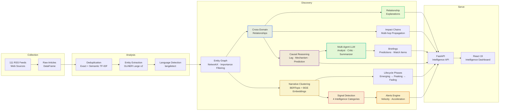
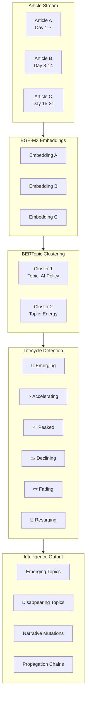

<div align="center">

# NewsPulse

### **AI-Powered Cross-Domain Intelligence Discovery Engine — v3.0**

[](https://python.org)
[](https://react.dev)
[](https://fastapi.tiangolo.com)
[](https://typescriptlang.org)
[](https://developer.nvidia.com/cuda-toolkit)
[](LICENSE)

<p align="center">
  <i>Surface hidden relationships across politics, finance, technology, energy, military, and more —<br>
  before they become obvious.</i>
</p>

<br>

```
                        ╔═══════════════════════════════════════════╗
                        ║   111 RSS feeds · 8 sectors · 17-step   ║
                        ║   intelligence pipeline · continuous     ║
                        ║   autonomous execution · auth secured    ║
                        ╚═══════════════════════════════════════════╝
```

</div>

---

## Overview

NewsPulse is a fully autonomous intelligence platform that continuously monitors 111+ news sources across 8 sectors, extracts entities using state-of-the-art GLiNER NER, discovers hidden cross-domain relationships, tracks narrative evolution through BERTopic clustering, detects emerging signals, performs causal reasoning with impact chain propagation, runs multi-agent LLM analysis via Ollama, generates intelligence briefings, and serves everything through a polished, **auth-secured** intelligence dashboard — **all with a single command**.

**v3.0** delivers the full Phase 3–5 roadmap: causal reasoning, confidence calibration, multi-agent LLM orchestration, temporal pattern mining, real-time alerts, Neo4j graph storage, export capabilities, JWT authentication with role-based access control, and rate-limited API endpoints.

Unlike traditional news analytics platforms that surface frequency-based dashboards and co-occurrence matrices, NewsPulse is designed from the ground up as an **intelligence discovery engine**. Every component — from entity extraction to relationship scoring to signal detection — is optimized to answer one question:

> **What meaningful connections exist that aren't yet obvious?**

<br>

## Vision & Mission

| | |
|---|---|
| **Vision** | Transform raw, unstructured news data into actionable cross-domain intelligence by revealing the hidden relationships, causal chains, and narrative shifts that connect seemingly unrelated sectors. |
| **Mission** | Make every intelligence discovery explainable — not just showing *that* entities are connected, but *why* they are connected, *how important* the connection is, *causal direction*, and *what downstream effects* to monitor. |
| **Differentiation** | Most platforms track *what happened*. NewsPulse tracks *what connects across domains* — the spillover effects, the propagation chains, the emerging signals that traditional analytics miss. |

<br>

## Key Capabilities

<table>
<tr>
  <td width="50%" valign="top">
    <h3>🧠 Cross-Domain Relationship Discovery</h3>
    Automatically maps entities to 8 sectors, surfaces hidden cross-domain connections with semantic similarity scoring, generates human-readable explanations, and provides causal direction inference with impact predictions.
    <br><br>
    <em>Output:</em> Entity-sector map, weighted relationship graph, impact chains, causal analysis
  </td>
  <td width="50%" valign="top">
    <h3>📊 Narrative Evolution Engine</h3>
    Tracks how narratives emerge, accelerate, peak, decline, and resurge across time windows. Uses BERTopic clustering with BGE embeddings for coherent topic discovery with lifecycle phase detection.
    <br><br>
    <em>Output:</em> Narrative lifecycle phases, mutation tracking, emerging/disappearing topics
  </td>
</tr>
<tr>
  <td width="50%" valign="top">
    <h3>🚨 Intelligence Signal Detection</h3>
    Beyond simple burst detection — identifies emerging relationships, cross-domain spillover effects, influence shifts, and statistical anomalies in entity co-mentions. Includes configurable velocity, acceleration, and burst thresholds.
    <br><br>
    <em>Output:</em> Ranked signals with types, severity scores, burst factors, real-time alerts
  </td>
  <td width="50%" valign="top">
    <h3>🔍 Semantic Intelligence Search</h3>
    Hybrid BM25 + BGE-M3 vector search with optional BGE reranker for precision. Ask natural language questions about cross-domain intelligence.
    <br><br>
    <em>Output:</em> Relevance-ranked results with source diversity
  </td>
</tr>
<tr>
  <td width="50%" valign="top">
    <h3>🕸 Interactive Intelligence Explorer</h3>
    Three-panel exploration: entity discovery → focused relationship graph → intelligence explanation. Every edge is explainable with impact assessment, causal direction, and downstream effects.
    <br><br>
    <em>Interface:</em> Entity search, filtered graph, explanation panel
  </td>
  <td width="50%" valign="top">
    <h3>⚡ Fully Autonomous Operation</h3>
    Single-command startup. APScheduler runs the full 17-step intelligence pipeline on a configurable interval. All outputs are atomically written for thread safety with real-time WebSocket broadcast on completion.
    <br><br>
    <em>Reliability:</em> Self-healing scheduler, atomic I/O, graceful recovery, circuit breakers
  </td>
</tr>
<tr>
  <td width="50%" valign="top">
    <h3>🤖 Multi-Agent LLM Analysis</h3>
    Orchestrates three Ollama agents (analyst, critic, summarizer) to verify cross-domain relationships, critique findings, and generate intelligence briefings with predictive insights.
    <br><br>
    <em>Output:</em> Multi-agent analysis, intelligence briefings, predictions
  </td>
  <td width="50%" valign="top">
    <h3>🔐 Auth-Secured Intelligence API</h3>
    JWT-based authentication with role-based access control (viewer, analyst, admin). Rate-limited login/register endpoints. bcrypt password hashing. Middleware-gated intelligence endpoints.
    <br><br>
    <em>Security:</em> PyJWT, bcrypt, slowapi rate limiting, CORS restrictions
  </td>
</tr>
</table>

<br>

---

## System Architecture

```mermaid
graph TB
    subgraph Sources["Data Sources"]
        RSS["111 RSS Feeds<br/>8 Sectors"]
        WEB["Web Scraping<br/>Article Details"]
    end

    subgraph Pipeline["Intelligence Pipeline (17 Steps, Continuous)"]
        direction TB
        S1["① Scrape Web"] --> S2["② Scrape RSS"]
        S2 --> S3["③ Deduplication<br/>Exact + Semantic"]
        S3 --> S4["④ Fetch Details<br/>Boilerplate Removal"]
        S4 --> S5["⑤ NLP Analysis<br/>GLiNER NER · Language Detection"]
        S5 --> S6["⑥ Entity Graph<br/>NetworkX · Importance Filtering"]
        S6 --> S7["⑦ Cross-Domain<br/>Relationships · Impact Chains"]
        S7 --> S8["⑧ Causal Reasoning<br/>Lag Analysis · Mechanism Inference"]
        S8 --> S9["⑨ Narrative Evolution<br/>BERTopic · Lifecycle Phases"]
        S9 --> S10["⑩ Signal Detection<br/>Emerging · Spillover · Anomaly"]
        S10 --> S11["⑪ Multi-Agent LLM<br/>Analyst · Critic · Summarizer"]
        S11 --> S12["⑫ Temporal Analysis<br/>Patterns · Bursts · Anomalies"]
        S12 --> S13["⑬ Intelligence Briefings<br/>Predictions · Watch Items"]
        S13 --> S14["⑭ Alerts Engine<br/>Velocity · Acceleration · Phase"]
        S14 --> S15["⑮ Export Pipeline<br/>JSON · CSV · Markdown"]
        S15 --> S16["⑯ Neo4j Sync<br/>Graph Persistence"]
        S16 --> S17["⑰ Semantic Index<br/>BGE-M3 · ChromaDB"]
    end

    subgraph Storage["Atomic Storage Layer"]
        JSON["Intelligence JSON<br/>sector_map.json · cross_domain_links.json<br/>impact_chains.json · causal_analysis.json<br/>narrative_evolution.json · alerts.json<br/>multi_agent_analysis.json · briefings.json"]
        PARQUET["Analytics Cache<br/>news_analyzed.parquet"]
        VECTOR["Vector Index<br/>ChromaDB · BGE-M3"]
        GRAPH["Graph Database<br/>Neo4j (optional)"]
    end

    subgraph Auth["Authentication Layer"]
        JWT["JWT Token<br/>HS256 · 24h expiry"]
        RBAC["Role-Based Access<br/>viewer · analyst · admin"]
        RATE["Rate Limiting<br/>slowapi"]
    end

    subgraph Backend["FastAPI Server (port 8765)"]
        API["REST + WebSocket Endpoints<br/>health · cross-domain · entity-graph<br/>narratives · signals · search · explain<br/>causal · agents · temporal · briefings<br/>alerts · export · neo4j · auth"]
        SCHED["APScheduler<br/>Continuous Execution"]
    end

    subgraph Frontend["React SPA (port 5173)"]
        HOME["Intelligence Briefing<br/>Discoveries Feed + Map"]
        EXPLORE["Relationship Explorer<br/>3-Panel Investigation"]
        TIMELINE["Narrative Evolution<br/>Lifecycles + Propagation"]
        SEARCH["Intelligence Search<br/>Hybrid Semantic Queries"]
        SIGNALS["Emerging Signals<br/>Severity-ranked Alerts"]
    end

    Sources --> Pipeline
    Pipeline --> Storage
    Storage --> Backend
    Auth -->|Gate| Backend
    Backend -->|Auto-poll 30s| Frontend
    SCHED -.->|Trigger| Pipeline
```



<br>

## Intelligence Workflow



<br>

---

## Feature Deep Dive

### 🧠 Cross-Domain Relationship Engine

The core intelligence capability. Every entity extracted from articles is classified into one of 8 sectors using keyword matching augmented with semantic context. Relationships are discovered when entities from **different sectors** co-occur across multiple articles from diverse sources.

**Relationship Score =** `semantic_similarity × 0.40 + cooccurrence_count × 0.35 + source_diversity × 0.25`

> **Traditional approach:** "Entity A and Entity B appear together → relationship exists"
>
> **NewsPulse approach:** "Entity A (technology) and Entity B (finance) co-occur in 12 articles across 5 independent sources with strong semantic similarity. This represents a validated cross-domain intelligence signal."

#### Entity Sectors

| Sector | Examples | Detection Method |
|--------|----------|-----------------|
| 🏛️ Politics | Government, elections, policy, diplomacy | Keyword + location + org matching |
| 💰 Finance | Markets, inflation, banking, trade | Financial keyword + org lexicon |
| 💻 Technology | AI, semiconductors, cloud, quantum | Tech keyword + major company orgs |
| ⚡ Energy | Oil, renewables, nuclear, EV | Energy keyword + OPEC/major orgs |
| 🛡️ Military | Defense, conflict, cyber, intelligence | Military keyword + defense orgs |
| 🚀 Startups | Funding, VC, unicorns, incubation | Startup lexicon + VC firm orgs |
| 🌍 Social | Movements, rights, healthcare, education | Social keyword + humanitarian orgs |
| 🌐 Global Events | Disasters, summits, trade wars, treaties | Event keyword + multilateral orgs |

#### Example Impact Chains

```
Iran (global_events)
  → Strait of Hormuz (energy)
    → Oil Prices (energy → finance)
      → Inflation (finance)
        → Technology Stocks (finance → technology)
```

```
China Export Restrictions (technology)
  → Semiconductor Shortage (technology)
    → Startup Funding Decline (technology → startups)
      → Innovation Slowdown (startups → technology)
```

<br>

### 📈 Narrative Evolution Engine



Each tracked entity or cluster passes through detectable lifecycle phases:

| Phase | Signal | Action |
|-------|--------|--------|
| 🌱 **Emerging** | Recent first appearance, low volume | Monitor for acceleration |
| ⚡ **Accelerating** | Growth rate > 50%, positive acceleration | Investigate causality |
| 📈 **Growing** | Steady increase, broad source coverage | Track propagation |
| 📊 **Peaked** | Stabilized at high volume | Prepare for decline |
| 📉 **Declining** | Negative growth rate | Document final impact |
| 💤 **Fading** | Rapid volume decrease | Archive |
| 🔄 **Resurging** | Renewed growth after decline | Re-evaluate relevance |

<br>

### 🚨 Signal & Alerts Categories

| Signal Type | Description | Priority | Example |
|-------------|-------------|----------|---------|
| **Emerging Relationship** | Entities from different sectors co-mentioned for first time | ★★★ | *"TSMC" + "German auto industry"* |
| **Cross-Domain Spillover** | Keyword from sector A spikes in sector B coverage | ★★★ | *"chip shortage" appearing in automotive news* |
| **Anomaly** | Entity mentions statistically exceed baseline | ★★☆ | *Entity X at 20× normal mention rate* |
| **Narrative Acceleration** | Topic velocity crossing acceleration threshold | ★★☆ | *"quantum computing" narrative doubling in 48h* |

Alerts are generated based on configurable thresholds for velocity acceleration (default 3.0), velocity magnitude (default 2.0), burst (default 3.0), phase transitions, and relationship confidence.

<br>

### 🤖 Multi-Agent LLM Analysis (Ollama)

When `intelligence.multi_agent.enabled: true`, NewsPulse orchestrates three Ollama agents:

| Agent | Model (default) | Role |
|-------|----------------|------|
| **Analyst** | `qwen3:14b` | Verifies cross-domain relationships, assesses strength, infers causal direction |
| **Critic** | `qwen3:14b` | Reviews analyst findings for confidence, suggests alternative explanations |
| **Summarizer** | `qwen3:14b` | Generates weekly intelligence briefings with watch items and predictions |

Results are stored in `multi_agent_analysis.json` and `intelligence_briefing.json`. All agents include circuit breaker protection (3 consecutive failures → 5-minute backoff).

<br>

### 🔒 Authentication & Security

All API endpoints (except auth and health) are gated by JWT-based role authorization:

| Role | Level | Permissions |
|------|-------|-------------|
| **viewer** | 1 | Read all intelligence data, search, explain |
| **analyst** | 2 | Viewer + trigger pipeline runs, export data |
| **admin** | 3 | Analyst + create/delete users, full access |

**Security features:**
- **JWT (HS256)** — Tokens with 24h expiry, signed with configurable secret
- **bcrypt** — Password hashing with salted rounds
- **slowapi rate limiting** — 5 req/min on login, 2 req/min on register
- **CORS** — Restricted to `localhost:5173` and `127.0.0.1:5173`
- **Sanitized errors** — No stack traces or internal state exposed
- **Environment variable override** — `NEWSPULSE_AUTH_JWT_SECRET` for production secrets
- **Auth fallback** — Gracefully disables auth and warns when JWT secret is unset

Default admin credentials: `admin / admin` (first-run only — change immediately or set `NEWSPULSE_AUTH_JWT_SECRET`).

<br>

### 🧩 Causal Reasoning

Enabled via `causal.enabled: true`. The engine identifies potential causal relationships between entities using temporal lag analysis:

- **Lag window**: 6 hours to 14 days
- **Lookback**: 30 days of historical data
- **Mechanism inference**: Based on entity sector roles and common causal patterns
- **Impact prediction**: Directional forecasts of downstream effects

Results stored in `causal_analysis.json` with confidence scores, lag data, and mechanism explanations.

<br>

---

## Installation

### Prerequisites

| Requirement | Version | Purpose |
|-------------|---------|---------|
| Python | 3.10+ | Backend pipeline and intelligence engine |
| Node.js | 20+ | Frontend dashboard |
| npm | 10+ | Frontend package management |
| CUDA-capable GPU | Optional (12GB+ VRAM recommended) | GPU acceleration for embeddings and NER |
| Ollama | Optional | Multi-agent LLM analysis and relationship verification |

### Quick Start

```bash
# 1. Clone the repository
git clone https://github.com/your-org/newspulse
cd newspulse

# 2. Install Python dependencies
pip install -r requirements.txt

# 3. Install frontend dependencies
cd dashboard/frontend
npm install
cd ../..

# 4. Set JWT secret (recommended for production)
#    If unset, auth defaults to disabled with a startup warning
set NEWSPULSE_AUTH_JWT_SECRET=your-secure-secret-here

# 5. Start the intelligence platform (single command)
python dashboard/backend/main.py
```

> 🚀 The backend automatically starts the FastAPI server on **port 8765**, runs an initial intelligence pipeline, and schedules continuous re-execution every 15 minutes via APScheduler.

### Setting Up Users

After first startup, create users via the API:

```bash
# Login as admin (default credentials)
curl -X POST http://localhost:8765/api/auth/login \
  -H "Content-Type: application/json" \
  -d '{"username": "admin", "password": "admin"}'

# Register an analyst user (admin only)
curl -X POST http://localhost:8765/api/auth/register \
  -H "Content-Type: application/json" \
  -H "Authorization: Bearer <admin-token>" \
  -d '{"username": "analyst1", "password": "securepass123", "role": "analyst"}'
```

### Ollama Setup (Optional — Multi-Agent Analysis)

```bash
# Install Ollama from https://ollama.ai
# Pull the default model
ollama pull qwen3:14b
```

### Frontend Development

In a separate terminal (optional, for hot-reload development):

```bash
cd dashboard/frontend
npm run dev
```

The dashboard is available at **http://localhost:5173** (proxies `/api` to backend).

### Production Build

```bash
cd dashboard/frontend
npm run build
# Serve the dist/ directory via your preferred static server
```

<br>

---

## Configuration

All configuration is managed through a single YAML file at the project root: **`config.yaml`**. Settings can be overridden via environment variables with the `NEWSPULSE_` prefix (e.g., `NEWSPULSE_AUTH_JWT_SECRET`).

<details>
<summary><b>📄 View full configuration reference</b></summary>

```yaml
# config.yaml — NewsPulse v3.0

paths:
  data_dir: "."
  output_dir: "output"
  news_csv: "output/data/news_data.csv"
  analyzed_parquet: "output/data/news_analyzed.parquet"
  analyzed_csv: "output/data/news_analyzed.csv"
  update_log: "output/logs/update_log.json"

scraper:
  user_agent: "Mozilla/5.0 (Windows NT 10.0; Win64; x64) AppleWebKit/537.36"
  timeout: 15
  max_articles_per_source: 50
  global_article_cap: 500
  max_workers: 8
  retry_attempts: 3
  retry_backoff: 1.0
  request_delay: 0.0

nlp:
  batch_size: 64
  cache_size: 2048
  entity_threshold: 0.5

quality:
  dedup_threshold: 0.85
  enable_semantic_dedup: true
  enable_boilerplate_removal: true

intelligence:
  min_entity_mentions: 2
  min_link_cooccurrence: 2
  max_cross_domain_links: 200
  max_impact_chains: 50
  llm_verification: true
  llm_max_links: 20
  llm_model: "qwen3:14b"
  multi_agent:
    enabled: true
    analyst_model: "qwen3:14b"
    critic_model: "qwen3:14b"
    summarizer_model: "qwen3:14b"
  temporal:
    enabled: true
    anomaly_std_threshold: 2.0
    burst_z_threshold: 2.5
    min_burst_count: 2
  briefings:
    enabled: true
    include_predictions: true
    max_watch_items: 20

causal:
  enabled: true
  min_lag_hours: 6
  max_lag_days: 14
  lookback_days: 30
  max_candidates: 100
  max_chains: 30

vector_store:
  collection_name: "newspulse"
  embedding_model: "BAAI/bge-m3"
  reranker_model: "BAAI/bge-reranker-v2-m3"
  use_hybrid_search: true
  use_reranker: false

neo4j:
  enabled: false
  uri: "bolt://localhost:7687"
  user: "neo4j"
  password: ""

alerts:
  enabled: true
  velocity_acceleration_threshold: 3.0
  velocity_magnitude_threshold: 2.0
  burst_threshold: 3.0
  phase_transition_threshold: 0.7
  relationship_confidence_threshold: 0.8

auth:
  enabled: true
  jwt_secret: ""
  jwt_expiry_hours: 24

export:
  json_dir: "output/exports"
  csv_dir: "output/exports"
  markdown_dir: "output/exports"

scheduler:
  enabled: true
  interval_minutes: 15
  initial_delay_seconds: 10
  fail_safe: true

logging:
  level: "INFO"
  format: "%(asctime)s [%(levelname)s] %(name)s: %(message)s"
```

</details>

### Key Configuration Options

| Parameter | Default | Description |
|-----------|---------|-------------|
| `scheduler.interval_minutes` | `15` | Pipeline re-execution interval |
| `scheduler.initial_delay_seconds` | `10` | Delay before first pipeline run on startup |
| `intelligence.llm_verification` | `true` | Enable LLM-based relationship verification |
| `intelligence.llm_model` | `qwen3:14b` | Ollama model for relationship verification |
| `intelligence.multi_agent.enabled` | `true` | Enable multi-agent LLM orchestration |
| `auth.enabled` | `true` | Enable JWT authentication and RBAC |
| `auth.jwt_secret` | `""` | JWT signing secret (set via env var `NEWSPULSE_AUTH_JWT_SECRET` in production) |
| `causal.enabled` | `true` | Enable causal reasoning engine |
| `neo4j.enabled` | `false` | Enable Neo4j graph persistence |
| `alerts.enabled` | `true` | Enable real-time intelligence alerts |
| `vector_store.use_hybrid_search` | `true` | Enable BM25 + vector hybrid search |
| `nlp.entity_threshold` | `0.5` | GLiNER entity extraction confidence threshold |
| `scraper.global_article_cap` | `500` | Max articles collected per pipeline run |
| `export.json_dir` | `output/exports` | Directory for exported intelligence data |

<br>

---

## API Reference

The backend exposes REST + WebSocket endpoints on `http://localhost:8765`.

### Authentication

All intelligence endpoints (except `/api/health` and `/api/auth/*`) require a `Bearer` token in the `Authorization` header:

```
Authorization: Bearer <jwt-token>
```

### Endpoints

| Method | Endpoint | Auth Role | Description |
|--------|----------|-----------|-------------|
| `GET` | `/api/health` | None | System health, pipeline status, version |
| `GET` | `/api/pipeline-status` | viewer | Detailed pipeline execution state |
| `POST` | `/api/trigger-pipeline` | analyst | Manually trigger an intelligence pipeline run |
| `GET` | `/api/cross-domain` | viewer | Cross-domain relationship links + impact chains + sector map |
| `GET` | `/api/entity-graph` | viewer | Entity co-occurrence graph (nodes + edges) |
| `GET` | `/api/narratives` | viewer | Narrative evolution data with lifecycle phases |
| `GET` | `/api/signals` | viewer | Intelligence signals with severity ranking |
| `GET` | `/api/search?q=...&n=10` | viewer | Hybrid semantic search across indexed articles |
| `GET` | `/api/explain?source=...&target=...` | viewer | Generate structured intelligence explanation |
| `GET` | `/api/causal-analysis` | viewer | Causal reasoning results with lag analysis |
| `GET` | `/api/multi-agent-analysis` | viewer | Multi-agent LLM analysis and verification |
| `GET` | `/api/temporal-patterns` | viewer | Temporal burst and anomaly detection results |
| `GET` | `/api/briefing` | viewer | AI-generated intelligence briefing |
| `GET` | `/api/alerts` | viewer | Real-time intelligence alerts |
| `POST` | `/api/export?fmt=json` | analyst | Export intelligence data (json/csv/markdown) |
| `GET` | `/api/neo4j-status` | viewer | Neo4j graph database connection status |
| `POST` | `/api/auth/login` | None (rate-limited) | Authenticate and receive JWT token |
| `POST` | `/api/auth/register` | admin (rate-limited) | Register a new user |
| `WS` | `/ws?token=...` | viewer (token query param) | Real-time pipeline completion events |

### Rate Limiting

| Endpoint | Limit |
|----------|-------|
| `POST /api/auth/login` | 5 requests per minute per IP |
| `POST /api/auth/register` | 2 requests per minute per IP |

### Response Format Example

```json
// GET /api/cross-domain
{
  "links": [
    {
      "source_entity": "tsmc",
      "target_entity": "german auto industry",
      "source_sector": "technology",
      "target_sector": "finance",
      "cooccurrence_count": 12,
      "source_diversity": 5,
      "strength": 8.3,
      "semantic_similarity": 0.72,
      "confidence": 0.85,
      "causal_direction": "tsmc → german auto industry",
      "causal_mechanism": "supply_chain",
      "impact_prediction": "Likely to affect automotive production timelines within 6 months",
      "explanation": "TSMC (technology) and German auto industry (finance) show a cross-domain intelligence relationship..."
    }
  ],
  "chains": [
    {
      "chain": ["iran", "strait of hormuz", "oil prices"],
      "sectors": ["global_events", "energy", "finance"],
      "cross_domain_hops": 2,
      "total_weight": 87.0
    }
  ]
}
```

<br>

---

## Project Structure

<pre>
<code>
📦 newspulse/
├── <b>dashboard/</b>                         # Web interface & API server
│   ├── <b>backend/</b>
│   │   ├── <b>main.py</b>                     🚀 API server + APScheduler + lifespan
│   │   ├── <b>auth.py</b>                      🔐 JWT auth · bcrypt · RBAC
│   │   ├── <b>ws.py</b>                        WebSocket real-time events
│   │   └── <b>exporter.py</b>                   JSON/CSV/Markdown export
│   └── <b>frontend/</b>                       # React 19 + TypeScript + Vite 8
│       └── <b>src/</b>
│           ├── <b>pages/</b>                    # 5 intelligence pages
│           │   ├── home.tsx                # Intelligence Briefing + Map
│           │   ├── explore.tsx             # 3-panel Relationship Explorer
│           │   ├── timeline.tsx            # Narrative Evolution
│           │   ├── search.tsx              # Semantic Intelligence Search
│           │   └── signals.tsx             # Emerging Signals
│           ├── <b>components/</b>
│           │   ├── charts/                 # React Flow graph components
│           │   └── layout/                 # Sidebar, header, main layout
│           ├── <b>services/</b>
│           │   └── api.ts                  # Typed API client
│           ├── <b>types/</b>
│           │   └── index.ts                # TypeScript interfaces
│           └── <b>store/</b>
│               └── dashboard.ts            # Zustand state management
│
├── <b>intelligence/</b>                       # ★ Core intelligence engine
│   ├── <b>relationships.py</b>                 Cross-domain discovery + explanations
│   ├── <b>narratives.py</b>                    BERTopic clustering + lifecycle phases
│   ├── <b>signals.py</b>                       Signal detection (4 categories)
│   ├── <b>entity_graph.py</b>                  NetworkX graph with importance filtering
│   ├── <b>explanation.py</b>                   Intelligence explanation generation
│   ├── <b>agents.py</b>                        Multi-agent LLM orchestration (Ollama)
│   └── <b>alerting.py</b>                      Velocity/acceleration/phase alerts
│
├── <b>nlp/</b>                                  # Natural language processing
│   ├── <b>entities.py</b>                       GLiNER-based entity extraction
│   ├── <b>preprocess.py</b>                     Text cleaning, category extraction
│   └── <b>sentiment.py</b>                      Sentiment analysis
│
├── <b>compute/</b>                              # GPU/CPU device management
│   ├── <b>embeddings.py</b>                     BGE-M3 embedding model
│   └── <b>gpu_manager.py</b>                    CUDA auto-detection + fallback
│
├── <b>vector_store/</b>                         # Semantic search
│   ├── <b>chroma_store.py</b>                   ChromaDB + BM25 hybrid search
│   └── <b>neo4j_store.py</b>                    Neo4j graph database connector
│
├── <b>scraper/</b>                              # Data collection
│   ├── <b>rss_feeds.py</b>                      111 RSS feed definitions
│   ├── <b>rss_scraper.py</b>                    Multi-threaded RSS scraping
│   └── <b>sources.py</b>                        Web article detail scraping
│
├── <b>config/</b>                               # Configuration management
│   ├── <b>settings.py</b>                        YAML config loader + atomic I/O
│   └── <b>users.json</b>                         User database (bcrypt hashed)
│
├── <b>storage/</b>                              # Data persistence
│   ├── <b>manager.py</b>                         Parquet/CSV DataFrame management
│   └── <b>io.py</b>                              Atomic JSON read/write utilities
│
├── <b>quality/</b>                              # Data quality
│   ├── <b>dedup.py</b>                           Exact + semantic deduplication
│   └── <b>boilerplate.py</b>                     Boilerplate removal
│
├── <b>multilingual/</b>                         # Language detection
│
├── <b>docs/</b>                                 # Documentation
│   ├── SKILL.md, report.md
│   ├── integrity_review.md
│   └── stability_assessment.md
│
├── <b>scripts/</b>                              # Developer utilities
│   └── <b>validate_benchmarks.py</b>             Performance benchmark validator
│
├── <b>reports/</b>                              # Generated reports
│   └── <b>benchmark_results.json</b>             Benchmark output data
│
├── <b>pipeline.py</b>                           # ⛓ Intelligence pipeline orchestrator (17 steps)
├── <b>config.yaml</b>                           # 📋 Central configuration
├── <b>requirements.txt</b>                      # Python dependencies
├── <b>.gitignore</b>                            # Git exclusion rules
└── <b>README.md</b>                             # 📖 This document
</code>
</pre>

<br>

---

## Technology Stack

| Component | Technology | Purpose |
|-----------|------------|---------|
| **Entity Extraction** | GLiNER Large v2 | State-of-the-art open-source NER with domain flexibility |
| **Embeddings** | BAAI/bge-m3 | Multilingual, high-quality semantic embeddings |
| **Reranker** | BAAI/bge-reranker-v2-m3 | Optional precision improvement for search |
| **Narrative Clustering** | BERTopic | Topic evolution with BGE embeddings |
| **Entity Graph** | NetworkX | Graph analysis with degree centrality |
| **Vector Store** | ChromaDB | Persistent vector index for semantic search |
| **Graph Database** | Neo4j (optional) | Persistent entity graph for enterprise use |
| **Full-Text Search** | BM25 (rank_bm25) | Hybrid search complement |
| **Causal Reasoning** | Custom lag/mechanism engine | Temporal causal inference with confidence scoring |
| **Multi-Agent LLM** | Ollama (qwen3:14b) | Analyst, critic, summarizer agents with circuit breakers |
| **Signal Detection** | Statistical burst/anomaly | Velocity, acceleration, phase transition detection |
| **Scheduling** | APScheduler | Reliable background pipeline scheduling |
| **Auth & Security** | PyJWT + bcrypt + slowapi | JWT authentication, RBAC, rate limiting |
| **API Server** | FastAPI + uvicorn | High-performance async REST + WebSocket |
| **Frontend** | React 19 + TypeScript 6 | Modern SPA with Vite 8 |
| **Styling** | Tailwind CSS v4 | Utility-first dark-theme design |
| **Graph Visualization** | React Flow (@xyflow/react) | Interactive entity relationship graphs |
| **Map Visualization** | Leaflet | Geospatial intelligence distribution |
| **State Management** | Zustand | Lightweight frontend state |
| **GPU** | CUDA 12 | GPU acceleration via PyTorch |

<br>

---

## Performance

| Metric | Value | Notes |
|--------|-------|-------|
| **RSS Feeds** | 111 | Across 8 sectors, multi-threaded |
| **Pipeline Duration** | ~3.5 min | ~4,300 new articles (incremental, 17 steps) |
| **Entity Graph Nodes** | 500+ | After importance filtering |
| **GPU Memory** | ~4 GB | BGE-M3 embeddings + GLiNER NER |
| **Frontend Bundle** | ~572 KB JS + ~56 KB CSS | After Vite production build |
| **API Response Time** | < 50 ms | Static JSON file reads (atomic) + TTL cache |
| **Auto-Schedule** | Every 15 min | Configurable via APScheduler |
| **Scheduler Misfire** | 120s grace | Self-healing for delayed pipeline runs |

<br>

---

## Roadmap

<pre>
<code>
Phase 1   ████████████████████████████  ✅  Core Intelligence Engine
           Entity extraction (GLiNER) · Cross-domain relationships ·
           Narrative evolution · Signal detection · Semantic search

Phase 2   ████████████████████████████  ✅  Intelligence Dashboard
           5 intelligence pages · Focused graph · Explanations ·
           Auto-polling · Pipeline status · Continuous operation

Phase 3   ████████████████████████████  ✅  Intelligence Quality
           LLM relationship verification · Causal reasoning ·
           Cross-domain impact prediction · Confidence calibration

Phase 4   ████████████████████████████  ✅  Advanced Intelligence
           Multi-agent analysis (Ollama) · Temporal pattern mining ·
           Anomaly prediction · Automated intelligence briefings

Phase 5   ████████████████░░░░░░░░░░░░  🚧  Enterprise Features
           Auth & RBAC · Neo4j graph backend · Real-time streaming ·
           WebSocket events · Export (JSON/CSV/MD) · Alert engine

Phase 6   ░░░░░░░░░░░░░░░░░░░░░░░░░░░░  🔮  Next Generation
           Real-time streaming ingestion · Event-driven architecture ·
           Multi-language full support · Interactive timeline explorer ·
           Advanced summarization engine · Performance optimization
</code>
</pre>

<br>

---

## Security

- **JWT secret** must be configured via `NEWSPULSE_AUTH_JWT_SECRET` environment variable for production use
- All passwords are hashed with **bcrypt** (salted, never stored in plaintext)
- API endpoints are **rate-limited** to prevent brute force attacks
- **CORS** is restricted to known frontend origins
- Pipeline errors are **sanitized** before exposure — no stack traces or internal state leaked
- Configuration validation warns at startup if auth is disabled or secrets are missing
- Circuit breakers prevent LLM/Ollama resource exhaustion

<br>

---

## Contributing

Contributions are welcome. The project focuses on intelligence quality — every contribution should improve the accuracy, explainability, or reliability of discoveries.

### Guidelines

1. **Fork** the repository
2. **Create a feature branch** (`git checkout -b feature/improvement`)
3. **Make changes** following existing code conventions
4. **Verify** the intelligence pipeline imports and TypeScript build
5. **Submit a pull request**

```bash
# Verify your changes
cd dashboard/frontend && npx tsc --noEmit   # TypeScript check
cd dashboard/frontend && npx vite build     # Production build
python -c "from pipeline import run_pipeline; print('Pipeline OK')"  # Python check
```

<br>

---

## License

This project is licensed under the MIT License — see the [LICENSE](LICENSE) file for details.

<br>

---

## Acknowledgements

- **[GLiNER](https://github.com/urchade/GLiNER)** — State-of-the-art open-source NER model
- **[BAAI/bge-m3](https://huggingface.co/BAAI/bge-m3)** — Multilingual embedding model
- **[BERTopic](https://maartengr.github.io/BERTopic/)** — Topic modeling framework
- **[React Flow](https://reactflow.dev)** — Interactive graph visualization library
- **[Leaflet](https://leafletjs.com)** — Open-source mapping library
- **[ChromaDB](https://www.trychroma.com)** — AI-native vector database
- **[APScheduler](https://apscheduler.readthedocs.io/)** — Advanced Python scheduler

<br>

---

<p align="center">
  <sub>Built with ❤️ for intelligence discovery</sub>
  <br>
  <sub>© 2026 NewsPulse — MIT Licensed</sub>
</p>
